##Writeup Template
###You can use this file as a template for your writeup if you want to submit it as a markdown file, but feel free to use some other method and submit a pdf if you prefer.

---

**Vehicle Detection Project**

The goals / steps of this project are the following:

* Perform a Histogram of Oriented Gradients (HOG) feature extraction on a labeled training set of images and train a classifier Linear SVM classifier
* Optionally, you can also apply a color transform and append binned color features, as well as histograms of color, to your HOG feature vector. 
* Note: for those first two steps don't forget to normalize your features and randomize a selection for training and testing.
* Implement a sliding-window technique and use your trained classifier to search for vehicles in images.
* Run your pipeline on a video stream (start with the test_video.mp4 and later implement on full project_video.mp4) and create a heat map of recurring detections frame by frame to reject outliers and follow detected vehicles.
* Estimate a bounding box for vehicles detected.

[//]: # (Image References)
[image1]: ./examples/car_not_car.png
[image2]: ./examples/HOG_example.jpg
[image3]: ./examples/sliding_windows.jpg
[image4]: ./examples/sliding_window.jpg
[image5]: ./examples/bboxes_and_heat.png
[image6]: ./examples/labels_map.png
[image7]: ./examples/output_bboxes.png
[video1]: ./project_video.mp4

## [Rubric](https://review.udacity.com/#!/rubrics/513/view) Points
###Here I will consider the rubric points individually and describe how I addressed each point in my implementation.  

---
###Writeup / README

####1. Provide a Writeup / README that includes all the rubric points and how you addressed each one.  You can submit your writeup as markdown or pdf.  [Here](https://github.com/udacity/CarND-Vehicle-Detection/blob/master/writeup_template.md) is a template writeup for this project you can use as a guide and a starting point.  

You're reading it!

### Histogram of Oriented Gradients (HOG)

#### 1. Explain how (and identify where in your code) you extracted HOG features from the training images.

The code for this step is contained in function `get_hog_features` in the program file `CarDetectorFunctions.py` in lines #304 through #321.  

I started by reading in all the `vehicle` and `non-vehicle` images.  Here is an example of one of each of the `vehicle` and `non-vehicle` classes:

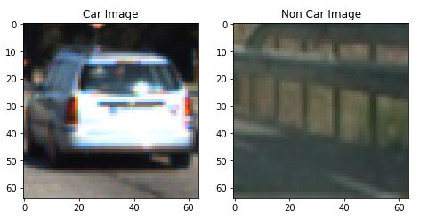

I then explored different color spaces such as YrCrb, RGB, LUV, and YUV, and different `skimage.hog()` parameters (`orientations`, `pixels_per_cell`, and `cells_per_block`).  I grabbed random images from each of the two classes and displayed them to get a feel for what the `skimage.hog()` output looks like.

Here is an example using the `YUV` color space and HOG parameters of `orientations=9`, `pixels_per_cell=(8, 8)` and `cells_per_block=(2, 2)`:

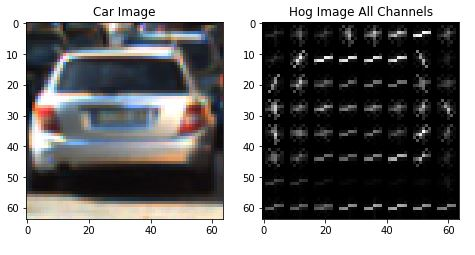
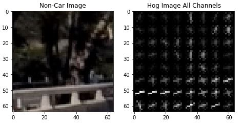

#### 2. Explain how you settled on your final choice of HOG parameters.

I tried various combinations of parameters and the parameters above appeared to show the best contrast when combining all the channels of a color image.  RGB did not appear to do well for HOG extraction.  Other color spaces did ok but it seemed that YUV was the best.  Changing the orientation from 9 to more bins had increasingly worse results most likely due to overfitting; reducing the orientations seemed to generalize too much and got more false positives.  Increasing the pixels per cell also seemed to generalize too much causing more false positives.

#### 3. Describe how (and identify where in your code) you trained a classifier using your selected HOG features (and color features if you used them).

I trained a linear SVM using HOG, color features, and spatial binning.  The code is located in `CarDetectorTrainer.py` in lines #54 through #106.  The feature extraction is done by calling function `extract_features` on lines #66 and #72 in `CarDetectorTrainer.py`, which extracts car as well as non-car features in which to train.  Function `extract_features` is located in the `CarDetectorFunctions.py` file in lines #468 through #518.  `extract_features` is configurable to do HOG, color histogram, and spatial binning of the image; all the features were concatenated together and sent back.  The car and non-car features were then stacked to a new array and normalized using sklearn's `StandarScaler` in order to get a balanced weighting of the values of each feature set.  A labels vectore/array was created to match the features and then all the data was split into a training and test set on line #96 in `CarDetectorTrainer.py`.  The data was then trained/fitted on lines #103 and #106.  All necessary objects were saved off to a pickle file for future use.

### Sliding Window Search

#### 1. Describe how (and identify where in your code) you implemented a sliding window search.  How did you decide what scales to search and how much to overlap windows?

Sliding windows were used by calling function `find_cars` in `CarDetector.yp` in lines #58, #67, and #75; The `find_cars` function resides in file `CarDetectorFunctions.py` on lines #379 through #460.  The `find_cars` function was implemented to accept a scaling factor to change the size of window size and perform HOG and color feature extraction on the window; configurable regions were also used.  Three scaling factors were used for three different regions.  Scaling of 2.0 for the close up with a bigger region since the car images images are bigger, 1.5 for the middle, and .75 for the far of the part road. This was specified in `CarDetector.py` on lines #53 through #75.  The sliding window overlap amounted to 75% since the window moved by 2 pixels using 8x8 windows; this was specified in `CarDetectorFunctions.py` on line #411.  Here are some images with windows that were discovered.

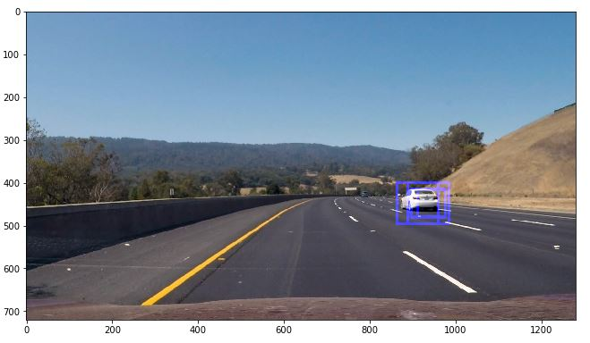
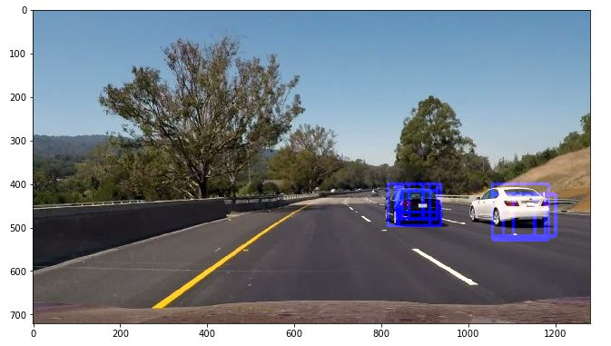

####2. Show some examples of test images to demonstrate how your pipeline is working.  What did you do to optimize the performance of your classifier?

The performance was optimized by doing the HOG feature extraction once for the whole image and using position pointers to extract HOG data for each window as opposed to extracting HOG features on every window found each time.  

Fewer false positives where achieved by cropping off the upper vertical portion of the image and searching using three scales using YUV 3-channel HOG features plus spatially binned color and histograms of color in the feature vector, which provided a nice result.  Applying heatmaps also eliminated false positives by only keeping overlapping boxes of detected vehicles on 2 or more.  Here are is an image after it was heatmapped and thresholded:

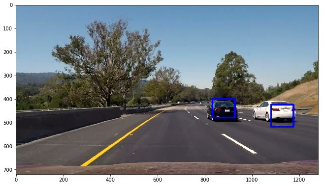
---

### Video Implementation

####1. Provide a link to your final video output.  Your pipeline should perform reasonably well on the entire project video (somewhat wobbly or unstable bounding boxes are ok as long as you are identifying the vehicles most of the time with minimal false positives.)
Here's a [link to my video result](./marked_video.mp4)

####2. Describe how (and identify where in your code) you implemented some kind of filter for false positives and some method for combining overlapping bounding boxes.

I built a heatmaps of the positive detections in each frame and for each scaling factor of the video in file `CarDetectorFunction.py`, function `find_cars`, on line #464; The three heatmaps generated for each scaling factor used and region were added together and then a threshold was applied in file `CarDetector.py` on line 82 to identify vehicle positions.  I then used `scipy.ndimage.measurements.label()` to identify individual blobs in the heatmap.  I then assumed each blob corresponded to a vehicle.  I constructed bounding boxes to cover the area of each blob detected.  

To smooth out the detections 12 frames of heatmaps were saved and the average of those were used to draw the boxes around the vehicle.  This was done in `CarDetector.py` in lines #84 through #94.

Here's an example result showing the heatmap from a series of frames of video, the result of `scipy.ndimage.measurements.label()` and the bounding boxes then overlaid on the last frame of video:

### Here are six frames and their corresponding heatmaps:

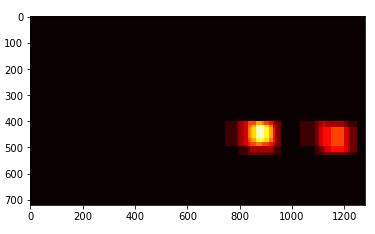
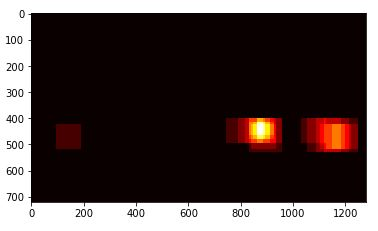
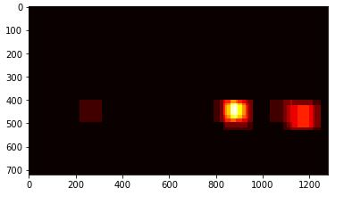
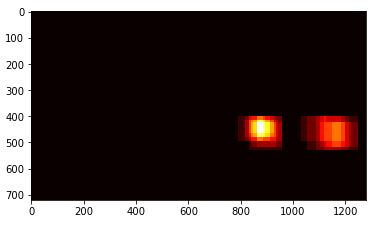

### Here is the output of `scipy.ndimage.measurements.label()` on the integrated heatmap from all six frames after thresholding:
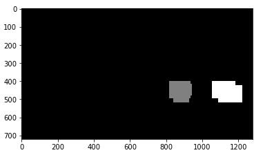

### Here the resulting bounding boxes are drawn onto the last frame in the series:
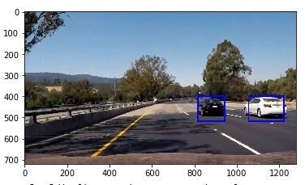

---

###Discussion

####1. Briefly discuss any problems / issues you faced in your implementation of this project.  Where will your pipeline likely fail?  What could you do to make it more robust?

Here I'll talk about the approach I took, what techniques I used, what worked and why, where the pipeline might fail and how I might improve it if I were going to pursue this project further.  

I mainly used the techniques provided in the lessons. I built the heatmap while locating cars instead of recording positions and then building the heatmap which improved performance. Deviating from what was presented in the lessons did not seem to improve the model at all.  I would need much more time to fiddle with all the parameters and study how each affects the result.  

Needs lots of samples. Extraction did not do near as well when using a smaller amounts of training samples.  So, i think more samples would make it more robust.

One problem with this version is that it may not track cars accurately and there realtime position when they are doing sharp turns because the smoothing(averaging of the frames) may not be quick enough to detect .  A better algorithym could be made to specifically look for sharp changes; more would also need to be done about false positives since the algorithym would need to be more sensitive to changes.

An improvement in performance could be made when averaging the frames by using the coordinates of the labels only and keeping track of each vehicle separately.

